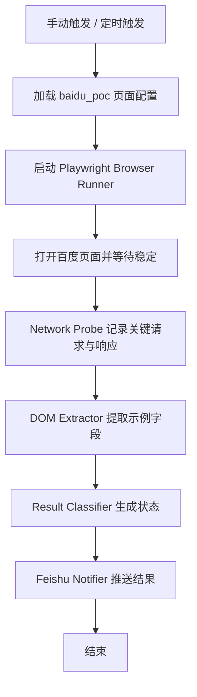
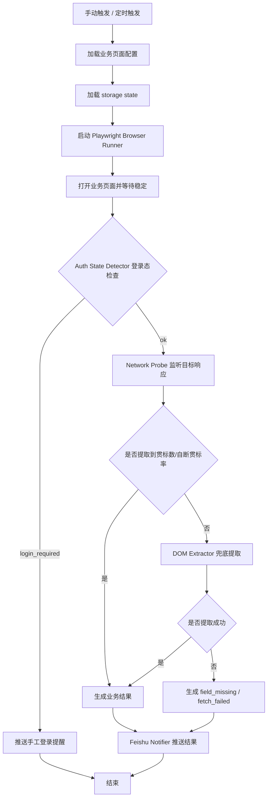

# Playwright 页面抓取与飞书推送方案设计

## 1. 背景与目标

为避免 open-cli 作为主抓取链路带来的调度复杂度、稳定性不足和错误不可诊断问题，本方案改为基于 Playwright 的页面抓取框架。

设计目标分为两个阶段：

### 阶段 A：百度 PoC
先使用 `baidu_poc` 页面验证公共抓取框架，跑通以下能力：

- Playwright 打开固定页面
- 监听关键网络请求 / 响应
- 从 DOM 中提取示例字段
- 支持手动触发与 Hermes cron 定时触发
- 将结果推送到飞书群
- 正确输出 `ok` / `field_missing` / `fetch_failed` 三种状态

### 阶段 B：业务页面定制
在百度 PoC 稳定后，再切换到真实业务页面，并补充：

- storage state 复用
- 登录失效判定 `login_required`
- 网络响应优先提取业务字段：
  - 贯标数
  - 自断贯标率
- DOM 作为兜底提取路径

---

## 2. 设计原则

### 2.1 框架与业务解耦
先用公开页面验证抓取框架，再接业务页面，避免在框架尚未稳定时把登录、业务字段、站点特性等问题混在一起。

### 2.2 网络响应优先
对于真实业务页面，优先从网络响应中提取数据，DOM 仅作为兜底。这样更稳定，也更接近长期可演进为纯 HTTP/API 抓取的目标形态。

### 2.3 登录由人工完成
系统不负责自动登录、不保存账号密码；业务阶段只复用人工登录后的浏览器态，并在失效时推送飞书提醒。

### 2.4 统一状态模型
从百度 PoC 开始就使用未来可复用的状态模型，避免后续迁移时推倒重写。

### 2.5 可替换架构
将 Browser Runner、Network Probe、DOM Extractor、Result Classifier、Notifier 拆成清晰模块，使百度 PoC 与业务页面共用同一条主干流程。

---

## 3. 总体架构

本方案分为两层：

### 3.1 公共抓取框架层
这一层在百度阶段就完成，后续业务页面继续复用：

1. **Page Config**
   - 页面标识、URL、等待条件、DOM 提取规则、网络探测规则、飞书目标

2. **Browser Runner**
   - 启动 Playwright
   - 打开页面
   - 等待页面稳定

3. **Network Probe**
   - 监听页面请求与响应
   - 输出结构化网络探测结果

4. **DOM Extractor**
   - 从页面中提取目标字段
   - 百度阶段用于示例字段
   - 业务阶段用于兜底字段

5. **Result Classifier**
   - 输出统一状态：`ok` / `field_missing` / `fetch_failed`
   - 业务阶段追加 `login_required`

6. **Feishu Notifier**
   - 将统一结果推送飞书群

7. **Entrypoints**
   - Hermes skill 手动触发
   - Hermes cron 定时触发

### 3.2 业务页面定制层
这一层在百度 PoC 跑通后再引入：

1. **Storage State Manager**
   - 加载人工登录后的 Playwright storage state

2. **Auth State Detector**
   - 判断登录态是否失效
   - 输出 `login_required`

3. **Business Metric Extractor**
   - 网络响应优先提取：贯标数、自断贯标率
   - DOM 兜底

---

## 4. 数据流设计

### 4.1 百度 PoC 数据流



### 4.2 业务页面扩展数据流



---

## 5. 百度 PoC 设计

## 5.1 页面标识
百度阶段页面标识固定为：

- `baidu_poc`

采用该命名是为了明确其性质是 PoC 验证页，而不是正式业务页面。

## 5.2 百度阶段字段
百度阶段的字段目标不是业务价值，而是验证框架能力。首期固定以下字段：

- `page_title`
- `search_input_name`
- `network_probe_hit`
- `network_probe_status`

字段含义：
- `page_title`：证明页面访问成功
- `search_input_name`：证明核心 DOM 已可稳定读取
- `network_probe_hit`：证明网络监听能力打通
- `network_probe_status`：证明可获得结构化响应状态信息

## 5.3 百度阶段状态定义

### `ok`
满足：
- 页面标题提取成功
- 搜索框字段提取成功
- 至少命中一个目标网络响应

### `field_missing`
满足：
- 页面可访问
- 但某个预期字段未提取成功

### `fetch_failed`
满足：
- 页面打不开
- 页面加载超时
- 提取流程整体失败

百度阶段不引入 `login_required`。

---

## 6. 业务页面阶段设计

在切换到真实业务页面后，新增以下能力：

## 6.1 登录态复用
通过 Playwright `storageState` 复用人工登录后的浏览器态。

约束：
- 不自动登录
- 不保存账号密码
- 仅加载登录后的状态文件

## 6.2 登录态判定
业务页面阶段新增状态：

- `login_required`

触发条件包括但不限于：
- 跳转到登录页
- 页面出现登录提示
- 关键业务接口返回未授权 / 认证失败
- 业务数据缺失且认证特征明确存在

## 6.3 真实业务字段
首期只提取两个字段：

- `贯标数`
- `自断贯标率`

策略：
- **一级来源：网络响应**
- **二级来源：DOM 兜底**

---

## 7. 触发方式设计

## 7.1 手动触发
首版手动触发入口定义为 **Hermes skill 调用入口**。

用途：
- 调试页面规则
- 补跑任务
- 验证抓取链路

百度 PoC 与业务页面均共用同一触发模型。

## 7.2 定时触发
定时触发通过 Hermes cron 调度同一个 skill。

用途：
- 验证定时链路
- 跑周期性巡检
- 在业务页面阶段执行无人值守抓取

百度 PoC 阶段就要验证该能力，避免后续业务页面接入时再引入新的调度不确定性。

---

## 8. 飞书消息设计

百度阶段虽然抓的是示例字段，但飞书消息结构建议尽量接近未来业务版。

### 8.1 正常结果

```text
【页面巡检结果】
页面：baidu_poc
状态：ok
页面标题：百度一下，你就知道
搜索框名称：wd
网络探测：命中
网络状态码：200
结论：公共抓取链路运行正常
```

### 8.2 字段缺失

```text
【页面字段缺失】
页面：baidu_poc
状态：field_missing
缺失字段：search_input_name
结论：页面可访问，但字段提取规则未命中
```

### 8.3 抓取失败

```text
【页面抓取失败】
页面：baidu_poc
状态：fetch_failed
原因：页面加载失败、超时或提取流程异常
```

### 8.4 业务阶段新增登录提醒

```text
【页面需要登录】
页面：业务页面标识
状态：login_required
原因：登录态失效，无法继续抓取
动作：请手工登录后重试
```

---

## 9. 模块边界与迁移原则

## 9.1 百度阶段完成后不变的部分
以下部分在切换到业务页面时应保持不变：

- skill 入口
- cron 调度方式
- 飞书推送方式
- 结果状态模型主结构
- 主 orchestrator 的基本数据流

## 9.2 切换到业务页面后会变化的部分
以下部分在业务阶段会调整：

- 页面配置
- Browser Runner 的等待条件
- Network Probe 的目标响应匹配规则
- DOM Extractor 的字段规则
- 新增 storage state 与 `login_required`

这种拆分的目的，是确保百度 PoC 只验证公共框架，而不会把业务细节耦合进去。

---

## 10. 验收标准

## 10.1 百度 PoC 完成标准
满足以下条件，即可视为百度阶段完成：

1. 手动触发可成功执行 `baidu_poc`
2. cron 定时任务可成功执行 `baidu_poc`
3. 可提取：
   - 页面标题
   - 搜索框字段
4. 可观测到目标网络响应
5. 飞书可收到正常结果通知
6. 字段缺失时可收到 `field_missing`
7. 页面访问失败时可收到 `fetch_failed`

## 10.2 业务页面完成标准
满足以下条件，即可视为业务页面阶段完成：

1. storage state 可复用
2. 登录失效可判定为 `login_required`
3. 可提取：
   - 贯标数
   - 自断贯标率
4. 飞书消息切换为业务字段输出

---

## 11. 分阶段实施建议

### Phase 1：百度 PoC
- 固定 `baidu_poc`
- 验证 Playwright 抓取、网络监听、DOM 提取、飞书推送、手动触发、定时触发

### Phase 2：业务页面迁移
- 替换页面配置
- 接入 storage state
- 新增登录态判定
- 接入业务字段提取

### Phase 3：稳定性收敛
- 优化等待条件
- 优化目标响应匹配规则
- 优化字段缺失与失败告警文案

---

## 12. 结论

本方案将原先以 open-cli 为主链路的网页抓取方案，重构为以 Playwright 为核心的两阶段抓取架构：

- 百度 PoC 阶段验证公共抓取框架
- 业务页面阶段补充登录态复用与真实业务字段提取
- 真实业务取数坚持“网络响应优先、DOM 兜底”原则
- 手动触发、定时触发和飞书通知从第一阶段开始就与未来业务阶段保持一致

该方案更符合长期可维护、可诊断、可演进的工程目标，也更适合后续平滑迁移到真实业务页面。