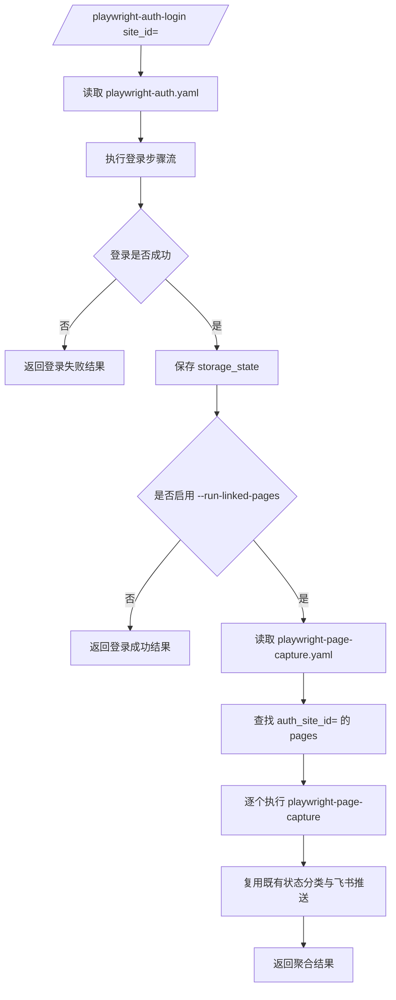

# Playwright Auth Login 串联 Page Capture 方案设计

## 1. 背景与目标

当前 `playwright-page-capture` 方案对登录态的支持方式是：

- 通过人工完成登录
- 保存 Playwright `storage_state`
- 后续抓取阶段复用该登录态

该模式稳定，但在标准账号密码登录场景下，仍需要人工介入。为此，本方案新增一个正式 skill：`playwright-auth-login`，用于在站点适配配置驱动下完成自动登录，并在登录成功后可选串联现有 `playwright-page-capture` 完成页面抓取与飞书推送。

本方案目标如下：

1. 新增正式 skill `/playwright-auth-login site_id=<id>`
2. 登录配置独立存放于 `~/.hermes/playwright-auth.yaml`
3. 第一版采用站点适配型方案，不追求任意站点通用
4. 第一版账号密码直接配置在 `playwright-auth.yaml`
5. 登录成功后保存 `storage_state`
6. 可选根据关联关系自动执行 linked pages 的 page capture
7. 复用现有 `playwright-page-capture` 的抓取、状态分类与飞书推送能力
8. 新 skill 在列表中可见、文档可见、运行提示可见，对齐 `playwright-page-capture` 的使用体验

---

## 2. 设计原则

### 2.1 站点适配优先，不追求完全通用

第一版采用站点适配型自动登录：通过 YAML 配置显式声明登录 URL、步骤流、成功判定，而不是尝试自动猜测任意网站的用户名框、密码框与提交按钮。

这样可以显著降低误判率，并将复杂度控制在可维护范围内。

### 2.2 登录与抓取解耦，通过编排串联

`playwright-auth-login` 不重写抓取逻辑，也不重写飞书推送逻辑。

职责拆分如下：

- `playwright-auth-login`：负责登录、保存 `storage_state`、可选触发关联 page capture
- `playwright-page-capture`：继续负责页面抓取、字段提取、状态分类、飞书推送

串联方式采用编排复用，而不是将所有逻辑硬塞进单一脚本。

### 2.3 配置独立，边界清晰

登录配置与页面抓取配置职责不同，因此新增独立配置文件：

- `~/.hermes/playwright-auth.yaml`：登录站点定义
- `~/.hermes/playwright-page-capture.yaml`：页面抓取定义

抓取配置通过 `auth_site_id` 关联登录站点。

### 2.4 第一版优先闭环，不做高复杂认证能力

第一版仅覆盖标准账号密码站点登录闭环，不在首版纳入验证码、OTP、MFA、条件分支、JS 自定义脚本等高复杂能力。

### 2.5 新 skill 的可发现性必须对齐现有 skill

新 skill 必须像 `playwright-page-capture` 一样：

- 以正式 skill 形式存在于 `optional-skills/communication/`
- 提供 `DESCRIPTION.md`
- 提供 `SKILL.md`
- 提供清晰的 CLI stdout/stderr 提示
- 提供结构化 JSON 返回结果

---

## 3. 总体架构

本方案由三部分组成：

1. **Auth Skill 层**
   - 读取 `playwright-auth.yaml`
   - 加载 `site_id` 对应的登录配置
   - 执行登录步骤流
   - 校验登录是否成功
   - 保存 `storage_state`

2. **Capture 编排层**
   - 当启用 `--run-linked-pages` 时
   - 查找所有 `auth_site_id=<site_id>` 的 page 配置
   - 逐个调用现有 page capture 入口

3. **既有 Page Capture 层**
   - 按既有配置执行页面抓取
   - 提取 DOM / network 字段
   - 输出状态结果
   - 推送飞书通知

架构关系如下：



---

## 4. 配置设计

## 4.1 登录配置文件：`~/.hermes/playwright-auth.yaml`

该文件用于定义登录站点。

建议结构如下：

```yaml
sites:
  - site_id: feishu_admin
    name: Feishu Admin
    login_url: https://example.com/login
    username: demo_user
    password: demo_pass
    storage_state_path: feishu/feishu_admin.js
    steps:
      - action: fill
        selector: "input[name='username']"
        value_from: username
      - action: fill
        selector: "input[type='password']"
        value_from: password
      - action: click
        selector: "button[type='submit']"
      - action: wait_for_url
        not_contains: "/login"
    success_criteria:
      url_not_contains:
        - "/login"
      cookie_names:
        - session
        - token
```

### 字段说明

| 字段 | 类型 | 说明 |
|------|------|------|
| `site_id` | string | 登录站点唯一标识 |
| `name` | string | 站点名称，用于日志和结果输出 |
| `login_url` | string | 登录页 URL |
| `username` | string | 第一版明文账号 |
| `password` | string | 第一版明文密码 |
| `storage_state_path` | string | 登录成功后保存的状态文件路径 |
| `steps` | list | 登录步骤流 |
| `success_criteria` | object | 登录成功判定规则 |

### 第一步骤类型范围

第一版仅支持以下 action：

- `fill`
- `click`
- `wait_for_selector`
- `wait_for_url`

每个 action 的职责：

- `fill`：向输入框写入用户名或密码
- `click`：点击按钮或链接
- `wait_for_selector`：等待某个元素出现
- `wait_for_url`：等待 URL 满足条件，例如离开 `/login`

第一版不支持：

- 条件分支
- 循环
- JavaScript 自定义步骤
- iframe 特化处理
- 验证码识别
- MFA / OTP 自动输入

## 4.2 页面抓取配置文件：`~/.hermes/playwright-page-capture.yaml`

现有 page 配置新增一个可选字段：

- `auth_site_id`

示例：

```yaml
pages:
  - page_id: dashboard_main
    name: Dashboard Main
    url: https://example.com/dashboard
    auth_site_id: feishu_admin
    storage_state_path: feishu/feishu_admin.js
    wait_for:
      load_state: networkidle
      selector: ".dashboard-root"
    dom_fields:
      - field: page_title
        kind: title
    feishu_target:
      chat_id: oc_xxxxxxxxxx
```

### 关联关系约束

- `auth_site_id` 表示该 page 依赖哪个登录站点
- 一个 `site_id` 可以关联多个 `page_id`
- 登录成功后，若启用 `--run-linked-pages`，则查找所有匹配 `auth_site_id=<site_id>` 的 page 并逐个执行

该设计使 page 继续作为抓取主体，登录关系只作为前置依赖声明。

---

## 5. 命令与交互设计

## 5.1 命令形态

第一版支持如下命令：

```bash
/playwright-auth-login site_id=feishu_admin
/playwright-auth-login site_id=feishu_admin --run-linked-pages
```

行为定义：

- 不带 `--run-linked-pages`：只执行登录并保存状态
- 带 `--run-linked-pages`：登录成功后查找并执行所有关联 page capture

## 5.2 用户可见性要求

新 skill 必须对齐 `playwright-page-capture` 的可见性体验。

建议目录结构：

```text
optional-skills/communication/playwright-auth-login/
  DESCRIPTION.md
  SKILL.md
  scripts/
    playwright_auth_login.py
    playwright_auth_config.py
    playwright_auth_models.py
    playwright_auth_runner.py
```

### `DESCRIPTION.md` 的职责

- 在 skill 列表中可见
- 描述适用场景
- 标注可选串联 page capture 的能力
- 提供触发关键词

### `SKILL.md` 的职责

- 提供命令示例
- 提供配置文件位置说明
- 提供 auth YAML 示例
- 提供与 page capture 的关联方式说明
- 提供返回 JSON 示例

## 5.3 运行时提示信息

CLI 的 stdout/stderr 应提供清晰的分阶段提示，示例如下：

```text
[playwright-auth-login] Loading site config: feishu_admin
[playwright-auth-login] Opening login page...
[playwright-auth-login] Step 1/4 fill username
[playwright-auth-login] Step 2/4 fill password
[playwright-auth-login] Step 3/4 click submit
[playwright-auth-login] Step 4/4 wait for URL change
[playwright-auth-login] Login success, storage_state saved to ~/.hermes/stats/feishu/feishu_admin.js
[playwright-auth-login] Found 2 linked pages
[playwright-auth-login] Running page capture: dashboard_main
[playwright-auth-login] Running page capture: report_daily
[playwright-auth-login] Done
```

日志目标是让用户能直接看懂当前卡在：配置加载、登录步骤、登录成功判定、状态保存、还是后续 page capture。

---

## 6. 模块边界设计

## 6.1 `playwright-auth-login` 职责

负责：

1. 读取 auth 配置
2. 解析并校验 `site_id`
3. 启动 Playwright 浏览器上下文
4. 执行登录步骤流
5. 根据 `success_criteria` 判定登录结果
6. 保存 `storage_state`
7. 在启用 `--run-linked-pages` 时调度 page capture
8. 汇总结构化结果输出

不负责：

- DOM 字段提取
- network_probe 提取
- 飞书消息格式定义
- 飞书发送逻辑

## 6.2 `playwright-page-capture` 职责

继续负责：

1. 读取 page 配置
2. 打开目标页面
3. 执行 DOM / network 抓取
4. 输出 `ok` / `field_missing` / `fetch_failed` 等状态
5. 推送飞书消息

不负责自动登录流程本身。

---

## 7. 状态模型设计

## 7.1 登录阶段状态

新 skill 顶层登录状态定义为：

- `success`
- `login_failed`
- `step_failed`
- `timeout`
- `config_error`

### 含义说明

#### `success`
登录步骤执行完成，并且满足 `success_criteria`，`storage_state` 已成功保存。

#### `login_failed`
所有步骤执行完成，但未满足登录成功判定条件。

#### `step_failed`
执行某一步时发生失败，例如 selector 找不到、元素不可点击、等待条件不成立。

#### `timeout`
整体登录流程超时。

#### `config_error`
配置文件缺失、`site_id` 不存在、必填字段缺失、步骤配置非法等。

## 7.2 抓取阶段状态

后续 linked pages 的结果不重新设计状态，而是直接复用现有 `playwright-page-capture` 状态语言：

- `ok`
- `field_missing`
- `fetch_failed`
- 未来若已支持 `login_required`，则沿用该状态

## 7.3 返回结构

### 仅登录

```json
{
  "status": "success",
  "site_id": "feishu_admin",
  "storage_state_path": "/Users/admin/.hermes/stats/feishu/feishu_admin.js"
}
```

### 登录并串联抓取

```json
{
  "status": "success",
  "site_id": "feishu_admin",
  "storage_state_path": "/Users/admin/.hermes/stats/feishu/feishu_admin.js",
  "capture_summary": {
    "total": 2,
    "ok": 1,
    "failed": 1
  },
  "linked_pages": [
    {
      "page_id": "dashboard_main",
      "status": "ok"
    },
    {
      "page_id": "report_daily",
      "status": "fetch_failed"
    }
  ]
}
```

说明：

- 顶层 `status` 表示登录阶段结果
- `linked_pages` 表示后续抓取明细
- 登录成功但某些 page 抓取失败时，顶层仍为 `success`

---

## 8. 失败处理策略

### 8.1 登录失败即停止后续抓取

若登录阶段状态不是 `success`，则不触发任何 linked page capture。

### 8.2 登录成功但无关联 page 不视为失败

用户可能只是想刷新登录态。因此在 `--run-linked-pages` 模式下，如果没有找到任何关联 page：

- 顶层仍返回 `success`
- `linked_pages` 为空数组

### 8.3 单 page 失败不影响其他 page

若某个关联 page 执行失败：

- 记录该 page 的失败状态
- 继续执行剩余 linked pages
- 最终返回完整明细

### 8.4 page 通知失败不应中断整体编排

若某个 page 已完成抓取，但飞书发送失败：

- 在该 page 的结果中体现通知失败信息
- 不影响其他 page 的继续执行

---

## 9. 第一版范围控制

## 9.1 第一版要做的能力

1. 新增正式 skill `playwright-auth-login`
2. 新增独立配置文件 `~/.hermes/playwright-auth.yaml`
3. 支持 `site_id` 加载配置
4. 支持基础步骤流：`fill` / `click` / `wait_for_selector` / `wait_for_url`
5. 支持登录成功后保存 `storage_state`
6. 在 page 配置中新增 `auth_site_id`
7. 支持 `--run-linked-pages`
8. 复用现有 `playwright-page-capture` 执行抓取与飞书推送
9. 输出清晰的 CLI 提示信息与结构化 JSON

## 9.2 第一版明确不做的能力

1. 不做自动识别任意登录表单
2. 不做验证码自动处理
3. 不做 OTP / MFA 自动化
4. 不做一站点多账号切换
5. 不做新的独立飞书通知体系
6. 不新增独立 orchestration skill，例如 `/playwright-auth-and-capture`
7. 不支持条件分支、循环、脚本注入等复杂步骤能力

该范围控制的目的，是优先交付可验证、可维护的最小闭环，而不是在首版将系统扩展为浏览器 RPA 平台。

---

## 10. 验收标准

满足以下条件，即可视为该方案落地达标：

1. `playwright-auth-login` 在 skill 列表中可见
2. `DESCRIPTION.md` 与 `SKILL.md` 可见且说明完整
3. 可以从 `~/.hermes/playwright-auth.yaml` 正确加载 `site_id`
4. 可以按 steps 自动完成标准账号密码登录
5. 可以保存 `storage_state`
6. `playwright-page-capture.yaml` 支持 `auth_site_id`
7. `--run-linked-pages` 能查找并执行关联 pages
8. 关联 page 的抓取结果仍按既有规则推送飞书
9. CLI 输出过程清晰可读
10. 最终输出结构化 JSON 结果

---

## 11. 结论

本方案在现有 `playwright-page-capture` 架构基础上，新增一个正式的前置登录 skill：`playwright-auth-login`。

其核心思路不是将登录、抓取、通知全部重写，而是：

- 用独立 auth YAML 做站点适配型自动登录
- 登录成功后保存 `storage_state`
- 通过 `auth_site_id` 与 page 配置建立关联
- 在需要时串联复用现有 `playwright-page-capture`
- 保持既有抓取与飞书推送链路不变

该设计兼顾了：

- 第一版可落地性
- 技术边界清晰性
- 复用现有能力的稳定性
- 与现有 skill 一致的用户可见性与交互体验

适合作为当前 `playwright-page-capture` 体系下的扩展方案。